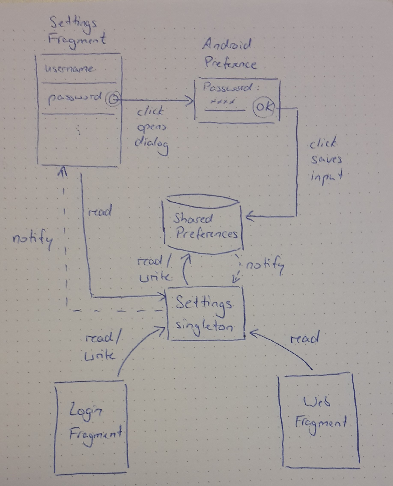

# meals-android

Android wrapper for the web app

# Installation
Download and install the following binary on your Android device: [app-release.apk](app-release.apk)

# Architecture

## Settings

The settings screen can be opened via the gear symbol on the web screen's toolbar. It allows the user to change
* his username
* his password
* the website's language (English / German)
* the app's reminder frequency (On Sundays / Before Every Weekday / Never)

### Implementation

All types related to the app's settings are contained in the `settings` package. Essentially, this includes
* the activity and the fragment that implement the UI
* the `Settings` singleton and the enums that provide an abstraction for reading and writing settings
* the `PreferenceKeys` singleton that contains the preference keys defined in `preferences.xml`

`preferences.xml` lays in the `app/res/xml/' directory.

The app's settings are stored in the app's default `SharedPreferences` object. The `SharedPreferences` object is accessed in two ways:
* by Android's `Preference`s that make up the settings screen
* by the `Settings` singleton that provides an abstraction to the `SharedPreferences`

The settings screen is implemented as described in the official docs: https://developer.android.com/guide/topics/ui/settings. The `SettingsActivity` holds the `SettingsFragment`. When created, the `SettingsFragment` loads its content from `preferences.xml` that declares the UI componentens which are visible on the settings screen and initializes them according to the settings stored in the `SharedPreferences`. Also, the `SettingsFragment` registers itselft with the `Settings` singleton to listen for settings changes and updates the UI.

The `Settings` singleton provides a simple API over the `SharedPreferences`. It hides the access to the underlying `SharedPreference` object as well as the keys and values used for storage. The `Language` and `ReminderFrequency` enums contain the possible values for the respective setting.

`PreferenceKeys` singleton merely contains the preference keys as defined in `preferences.xml`. The keys are used by `Settings` to save settings and `SettingsFragment` to find `Preference`s.

## Server Request

The server requests consists of two HTTP requests: a POST request that performs an OAuth login and returns the OAuth token and a GET request that uses the OAuth token to get the users meals participation for next week as a JSON string. That string is parsed for the relevant information: whether the user participates the next day.

When the alarm is triggered the app checks whether the user wants to be notified for the next day. If the next day is a weekday and the user set a reminder frequency that covers the next day this will be true.

In that case the app sends two server requests to determine whether the user is already registered for tomorrows meal:
1. A POST login request to receive a valid OAuth token
2. A GET current-week request (with the token) to receive the user's meal participation for the next week(s)

The app then extracts the participation value for the next day and notifies the user if it's false.

If a problem occurs when contacting the server, for example if the server is not available because the device is not connected to the network, the app will try to contact the server again every 5 minutes until it succeeds or the latest reminder time is passed.

## Notification

If the the user wants to be notified for the next day and the server request yields that he hasn't registered yet the user is remembered with a notification. Clicking the notification in the notification tray opens the web view.

Since Android 8.0 each app has one or multiple categories that a notification belongs to. Therefore, the app registers a single category on startup that the notification belongs to.

# Coding Guidelines

## Logging

To faciliate debugging every method that is invoked by the operating system logs the current thread, its name and its parameters. The only exception are methods that would obviously flood the log file like RecyclerView.Adapter.getItemCount().

For this purpose Android Studio provides Live Templates like 'logm' which generates code like this:

    Log.d(TAG, "onCreate() called with: savedInstanceState = [" + savedInstanceState + "]");

This project uses extended versions of these Live Templates that include the information on which thread the method is called. The previous 'logm' example is extended to 'logmt' that produces the following code:

    Log.d(TAG, Thread.currentThread().getName() + " ### "
                + "onCreate() called with: savedInstanceState = [" + savedInstanceState + "]");
                
The same applies to the other Live Templates ('logd' becomes 'logdt', 'loge' becomes 'loget', etc.)

Note that the thread name is separated from the method information by the sequence '###'. This allows for easily filtering the log to effectively hide system log entries.

Also, every exception is logged using 'loget':

    } catch (IOException | ParseException e) {
        Log.e(TAG, Thread.currentThread().getName() + " ### "
                + "accept: Couldn't read reminder time from config file. No alarm set.", e);
        return;
    }

## Naming Scheme for XML IDs

XML IDs must be unique within their context. In most cases that context corresponds to the containing layout file.

String IDs must be unique within their file. As all strings from all activities are defined in strings.xml all String IDs must be unique globally.

To keep things simple, the following naming scheme ensures that both IDs and String IDs are globally unique.

### IDs

IDs have the form

    <layout>_<widget>_<meaning>
    
where each part is written in CamelCase notation. For example:

    android:id="@+id/loginFragment_editText_username"
    
### String IDs
    
String IDs have the form

    <layout>_<widget>_<meaning>_<attribute>
    
For example:

    android:hint="@string/loginFragment_editText_username_hint"
